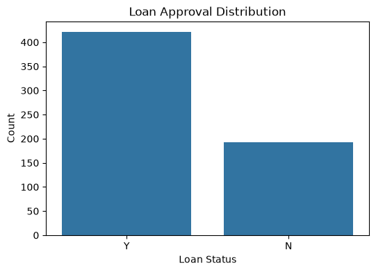
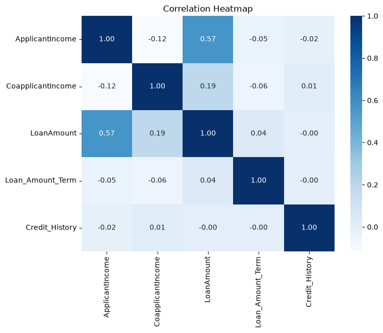
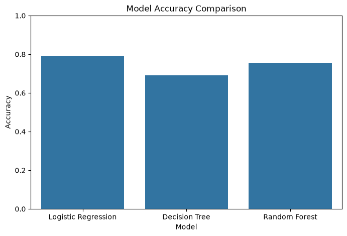

# Loan Approval Prediction using Machine Learning

## Project Overview

This project analyzes factors influencing loan approval and develops machine learning models to predict whether a loan application will be approved. The project includes data cleaning, exploratory data analysis (EDA), feature engineering, model training, evaluation, and comparison.

---

## Objectives

- Understand the structure of the dataset.
- Handle missing values.
- Perform Exploratory Data Analysis (EDA).
- Build multiple machine learning models.
- Compare model performance.
- Identify the best-performing model.

---

## Dataset

- Source: Kaggle Loan Prediction Dataset
- Records: 614
- Features: 13

Target Variable:
- Loan_Status

---

## Technologies Used

- Python
- Pandas
- NumPy
- Matplotlib
- Seaborn
- Scikit-learn

---

## Project Workflow

1. Data Loading
2. Data Exploration
3. Data Cleaning
4. Exploratory Data Analysis
5. Feature Encoding
6. Train-Test Split
7. Feature Scaling
8. Model Building
9. Model Evaluation
10. Conclusion

---

## Machine Learning Models

- Logistic Regression
- Decision Tree Classifier
- Random Forest Classifier

---

## Model Performance

| Model | Accuracy |
|--------|---------:|
| Logistic Regression | **78.86%** |
| Random Forest | **75.61%** |
| Decision Tree | **69.11%** |

---

## Key Insights

- Applicants with a positive credit history had a much higher chance of loan approval.
- Loan approval was also influenced by applicant income, education, and property area.
- Logistic Regression achieved the highest prediction accuracy.
- Data preprocessing significantly improved model performance.

---

## Project Structure

```
Loan-Approval-Prediction/
│
├── loan_approval_prediction.ipynb
├── loan_prediction.csv
├── README.md
├── requirements.txt
│
└── images/
    ├── loan_status.png
    ├── gender_distribution.png
    ├── education_vs_loan.png
    ├── credit_history.png
    ├── property_area.png
    ├── applicant_income.png
    ├── loan_amount.png
    ├── correlation_heatmap.png
    └── model_accuracy.png
```
## Loan Approval Distribution



## Correlation Heatmap



## Model Accuracy Comparison

 

---

## Key Learnings

Through this project, I gained practical experience in:

- Data cleaning and preprocessing
- Handling missing values
- Exploratory Data Analysis (EDA)
- Feature encoding and scaling
- Building and evaluating classification models
- Comparing machine learning algorithms
- Interpreting model performance using evaluation metrics

---

## Author

#### Harikaran G
##### Artificial Intelligence and Data Science
